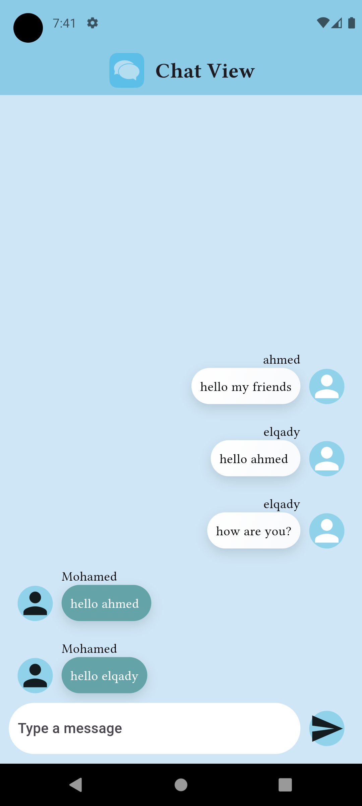
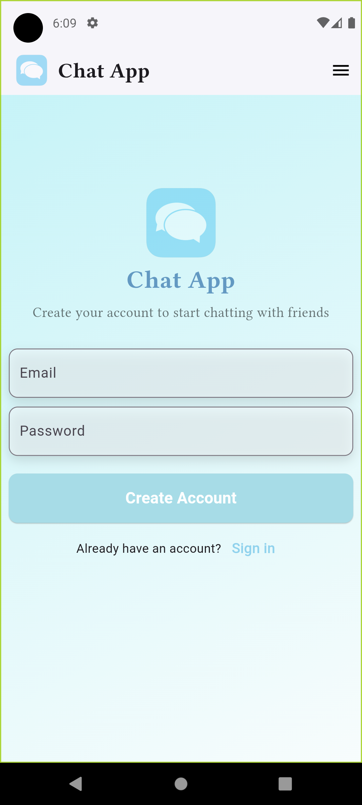
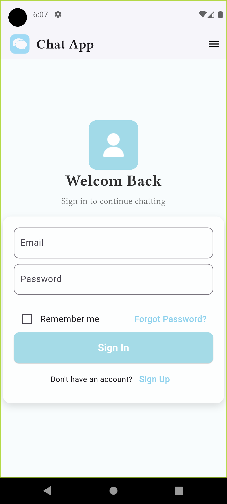
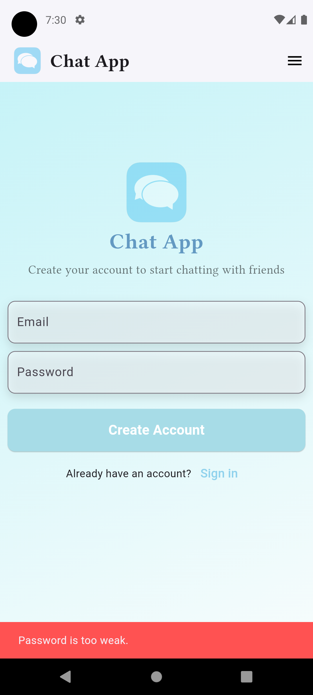
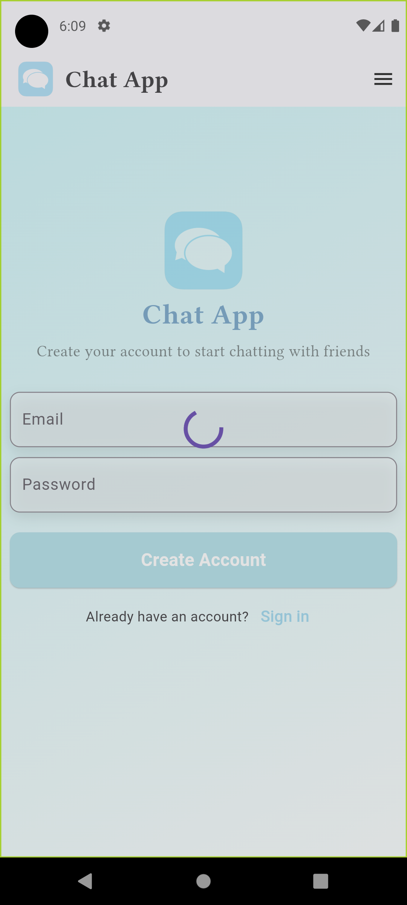

# 💬 Flutter Chat Application

  <!-- Tech Stack Badges -->
  
  
  
  

  <!-- Repo Status Badges -->
  
  
  
  
  

---

## 📌 Description
A **real-time chat application** built with **Flutter**, designed to provide seamless communication between users.  
The app integrates **Firebase Authentication** and **Cloud Firestore** to ensure secure login/signup and real-time messaging.  
It leverages **BLoC state management** to maintain a scalable and maintainable architecture.

---

## 🚀 Key Features

### 🔑 User Authentication
- Secure login & signup with **Firebase Authentication**.  
- Supports **email/password authentication**.  

### 💬 Chat Functionality
- Real-time messaging using **Cloud Firestore**.  
- Messages update instantly across all connected users.  

### 🎨 UI & Navigation
- Three main pages: **Login, Signup, Chat Page**.  
- Clean, **responsive design** for smooth navigation.  

### ⚡ State Management
- **BLoC pattern** ensures clean separation of UI and business logic.  
- Scalable structure for future features.  

### 🎯 User Experience Enhancements
- Added **ModalProgressHUD** to display loading indicators during auth & database operations.  
- Proper **error handling** for smooth navigation.  

---

## 🛠️ Technologies Used
- **Frontend:** Flutter (Dart)  
- **Authentication & Backend:** Firebase Authentication  
- **Database:** Cloud Firestore  
- **State Management:** BLoC  

---

## ✨ Highlights
- ✅ Real-time messaging with instant updates.  
- ✅ Secure authentication system.  
- ✅ Scalable and clean architecture with BLoC.  
- ✅ Smooth, user-friendly UI with error handling.  

---

## 📸 Screenshots  

  
  
  
  
  
  

---

